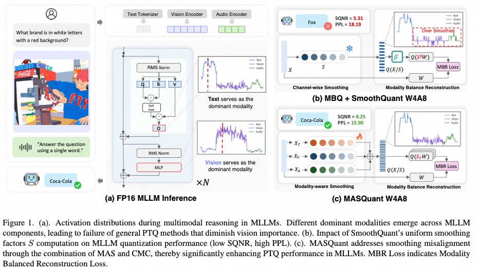
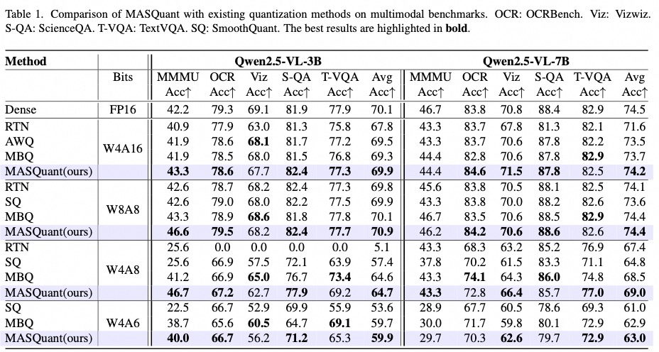
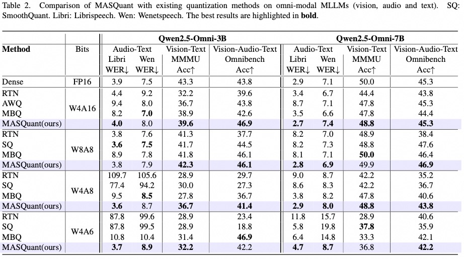
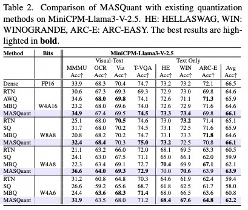

# MAS-Quant: Modality-Aware Symmetric Quantization for Multimodal Large Language Models

[](LICENSE)
[](https://www.python.org/downloads/)
[](https://pytorch.org/)

**MAS-Quant** is a post-training quantization (PTQ) framework specifically designed for Multimodal Large Language Models (MLLMs). It identifies and addresses **Smoothing Misalignment**—a critical failure mode where activation outliers from a dominant modality (typically vision) dictate scaling factors for all modalities, causing severe accuracy degradation in non-dominant modalities like audio and text. MAS-Quant solves this through **Modality-Aware Smoothing (MAS)** and **Cross-Modal Compensation (CMC)**, achieving stable quantization across text, vision, and audio modalities without memory overhead.




## 🌟 Key Strengths

- **🔬 Novel Problem Formalization**: First work to identify and mathematically formalize "Smoothing Misalignment" as the primary failure mode in MLLM quantization, explaining why traditional LLM quantization methods fail on omni-modal models

- **🎯 Modality-Aware Smoothing (MAS)**: Learns optimal per-modality scaling factors that respect the unique activation distributions of text, vision, and audio, preventing cross-modal interference

- **🔄 Cross-Modal Compensation (CMC)**: Bridges the gap between modality-specific weights using SVD-based low-rank matrices, maintaining unified weight structure while preserving modality-specific optimizations. Theoretical proof shows inter-modal differences are low-rank after whitening

- **🎵 Omni-Modal Stability**: Unlike previous vision-language focused methods, MAS-Quant demonstrates remarkable stability on audio-visual-text models (Qwen2.5-Omni), specifically preventing collapse of ASR (Speech Recognition) performance under aggressive 4-bit quantization

- **⚡ Inference Efficiency**: Adds minimal computational overhead (~2% FLOPs) affecting only the prefill phase, making it highly suitable for real-time inference scenarios

- **🔧 Wide Applicability**: Supports multiple MLLM architectures (Qwen2.5-VL, Qwen2.5-Omni, MiniCPM-V) and flexible quantization configurations (W4A16, W4A8, W4A6, W8A8)

## 📋 Table of Contents

- [Installation](#installation)
- [Quick Start](#quick-start)
- [Supported Models](#supported-models)
- [Usage](#usage)
- [Examples](#examples)
- [Citation](#citation)
- [Acknowledgments](#acknowledgments)
- [License](#license)

## 🔧 Installation

See [INSTALL.md](INSTALL.md) for detailed installation instructions.

**Quick Install:**

```bash
# Create conda environment
conda create -n masquant python=3.10 -y
conda activate masquant

# Install MAS-Quant
pip install -e .

# Install Flash Attention
pip install flash-attn==2.7.4.post1 --no-build-isolation --no-cache-dir

# Install lmms-eval for multimodal evaluation
pip install lmms-eval
```

## 🚀 Quick Start

### For Qwen2.5-VL (Text + Vision)

```bash
# Step 1: Generate activation scales
python generate_act_scale_shift.py \
    --model /path/to/Qwen2.5-VL-3B-Instruct \
    --dataset-type text-vision \
    --nsamples 128

# Step 2: Train modality-aware scales and evaluate (W4A8)
export inference_mode="split_scales"
python main.py \
    --model /path/to/Qwen2.5-VL-3B-Instruct \
    --mode train \
    --epochs 2 \
    --wbits 4 --abits 8 \
    --let \
    --loss_multi_modal_mae_alpha \
    --dataset-type text-vision \
    --nsamples 128 \
    --output_dir ./outputs \
    --symmetric \
    --group_size 0 \
    --tasks_multimodal textvqa,scienceqa
```

### For Qwen2.5-Omni (Text + Vision + Audio)

```bash
# Step 1: Generate activation scales for all three modalities
python generate_act_scale_shift.py \
    --model /path/to/Qwen2.5-Omni-3B \
    --dataset-type text-audio-vision \
    --nsamples 128

# Step 2: Train modality-aware scales and evaluate
export inference_mode="split_scales"
python main.py \
    --model /path/to/Qwen2.5-Omni-3B \
    --mode train \
    --epochs 2 \
    --wbits 4 --abits 8 \
    --let \
    --loss_multi_modal_mae_alpha \
    --dataset-type text-audio-vision \
    --nsamples 128 \
    --output_dir ./outputs \
    --symmetric \
    --group_size 0 \
    --eval_ppl
```

## 📦 Supported Models

| Model | Modalities | Sizes | Status |
|-------|------------|-------|--------|
| Qwen2.5-VL | Text + Vision | 3B, 7B | ✅ Fully Supported |
| Qwen2.5-Omni | Text + Vision + Audio | 3B, 7B | ✅ Fully Supported |
| MiniCPM-V | Text + Vision | 2.6B | ✅ Supported |

## 📊 Supported Quantization Configurations

| Configuration | Weight Bits | Activation Bits | Symmetric | Use Case |
|---------------|-------------|-----------------|-----------|----------|
| W4A16 | 4 | 16 | No | Weight-only quantization |
| W4A8 | 4 | 8 | Yes | Balanced quantization |
| W4A6 | 4 | 6 | Yes | Aggressive quantization |
| W8A8 | 8 | 8 | Yes | Conservative quantization |

## 📖 Usage

### 1. Generate Activation Scales

The first step is to generate activation distribution statistics from calibration data:

```bash
python generate_act_scale_shift.py \
    --model <model_path> \
    --dataset-type <data_type> \
    --nsamples <num_samples>
```

**Parameters:**
- `--model`: Path to the pre-trained model
- `--dataset-type`: Type of calibration data
  - `text-only`: Text-only data
  - `text-vision`: Text + vision data
  - `text-audio-vision`: All three modalities
  - `mas_mix_dataset`: Balanced mixed dataset
- `--nsamples`: Number of calibration samples (default: 128)

Output: Activation scales saved to `./act_scales/<model_name>-<dataset_type>-<nsamples>.pt`

### 2. Train Modality-Aware Scales

Train the quantization scales using the MAS-Quant algorithm:

```bash
export inference_mode="split_scales"  # Use modality-aware scales

python main.py \
    --model <model_path> \
    --mode train \
    --epochs <num_epochs> \
    --wbits <weight_bits> \
    --abits <activation_bits> \
    --let \
    --loss_multi_modal_mae_alpha \
    --dataset-type <data_type> \
    --nsamples <num_samples> \
    --output_dir <output_directory> \
    --symmetric \
    --group_size <group_size>
```

**Key Parameters:**
- `--mode`: Operation mode (`train` for training, `infer` for inference)
- `--epochs`: Number of training epochs (2-10 recommended)
- `--wbits`: Weight quantization bits (4 or 8)
- `--abits`: Activation quantization bits (6, 8, or 16)
- `--let`: Enable Learnable Equivalent Transformation (MAS-Quant)
- `--loss_multi_modal_mae_alpha`: Use modality-aware loss with gradient weighting
- `--symmetric`: Use symmetric quantization (recommended for weight-activation quantization)
- `--group_size`: Group size for weight quantization (0 for per-channel, 128 for group-wise)

Output: Trained scales saved to `<output_dir>/mas_parameters.pth`

### 3. Evaluate Quantized Model

#### Perplexity Evaluation

```bash
python main.py \
    --model <model_path> \
    --mode train \
    --epochs 0 \
    --eval_ppl \
    --wbits <weight_bits> \
    --abits <activation_bits> \
    --let \
    --resume <path_to_mas_parameters.pth>
```

#### Multimodal Benchmark Evaluation

```bash
python main.py \
    --model <model_path> \
    --mode train \
    --epochs 0 \
    --wbits <weight_bits> \
    --abits <activation_bits> \
    --let \
    --tasks_multimodal textvqa,scienceqa,vizwiz_vqa \
    --resume <path_to_mas_parameters.pth>
```
#### Cross-Modal Compensation Calibration and Evaluation
```bash
python infer_mas.py \
    --mode infer \
    --model /path/to/vl_model \
    --net qwen2.5-vl-3b \
    --scales_path /path/to/scales \
    --wbits 4 \
    --abits 8 \
    --LR \
    --quantize \
    --n_cali_samples 128 \
    --cali_data_type vision-audio-only \
    --rank 0.05 \
    --quant_cmc 0 \
    --eval_ppl \
    --tasks_multimodal scienceqa \
    --batch_size 1
```
**cmc Key Parameters:**
- `--scales_path`: path to the trained scales of MAS.
- `--rank`: rank ratio of low rank adapters
- `--cali_data_type`: SVD based whitening calibration data type.("vision-audio-only" for COCO+libritest; "text-audio-vision" for Omnibench; "no-white" for no whitening)


## 🎯 Examples

Detailed examples are available in the [examples](./examples/) directory:

- **[Qwen2.5-VL Example](./examples/qwen2_5_vl/)**: Complete workflow for quantizing Qwen2.5-VL models
- **[Qwen2.5-Omni Example](./examples/qwen2_5_omni/)**: Complete workflow for quantizing Qwen2.5-Omni models with three modalities

Each example includes:
- Activation scale generation scripts
- Training and evaluation scripts for different configurations (W4A6, W4A8, W8A8)
- Detailed README with configuration tips

## 🔍 Environment Variables

MAS-Quant supports two inference modes controlled by the `inference_mode` environment variable:

- `split_scales` (Recommended): Use modality-aware scales - separate scales for each modality
  ```bash
  export inference_mode="split_scales"
  ```

- `merged_scales`: Use unified scales - single scale for all modalities
  ```bash
  export inference_mode="merged_scales"
  ```

## 📈 Results

MAS-Quant achieves state-of-the-art performance on multimodal quantization:

### Qwen2.5-VL Results




### Qwen2.5-Omni Results




### MiniCPM-V Results




*For complete experimental results and analysis, please refer to our paper.*

## 📝 Citation

If you find MAS-Quant useful for your research, please cite our paper:

```bibtex
@article{masquant2026,
  title={MAS-Quant: Modality-Aware Symmetric Quantization for Multimodal Large Language Models},
  author={lulu hu, wenhu xiao, xinhu xu, xin chen, bowen xu, yongliang chen, kun li},
  journal={Conference/Journal name},
  year={2026}
}
```

## 🙏 Acknowledgments

This project builds upon excellent prior work:

- **[OmniQuant](https://github.com/OpenGVLab/OmniQuant)**: Foundation for the quantization framework
- **[Transformers](https://github.com/huggingface/transformers)**: HuggingFace's transformer models
- **[lmms-eval](https://github.com/EvolvingLMMs-Lab/lmms-eval)**: Multimodal evaluation framework
- **[SmoothQuant](https://github.com/mit-han-lab/smoothquant)**: Inspiration for smooth quantization techniques

## 📜 License

This project is licensed under the MIT License - see the [LICENSE](LICENSE) file for details.

## 🤝 Contributing

Contributions are welcome! Please feel free to submit a Pull Request.

## 📧 Contact

For questions or issues, please open an issue on the GitHub repository.

---

**Note:** Replace `/path/to/model` with actual model paths before running the commands. Refer to [examples](./examples/) for complete working scripts.
